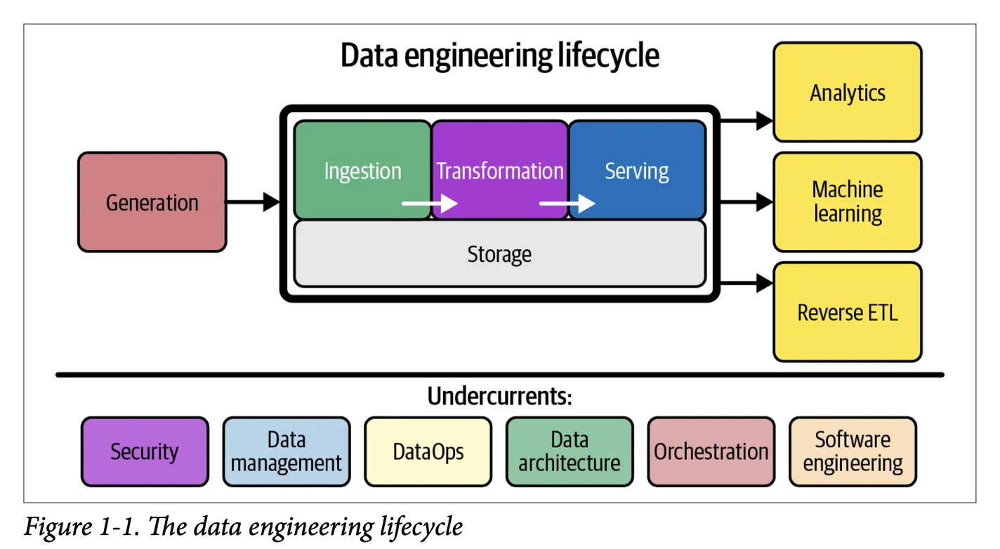
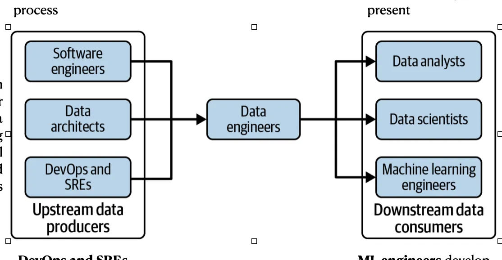

# 1. Problematization

Computational projects typically involve components of the data engineering lifecycle (Figure 1-1). Data generation takes one of three forms: (i) simulation, (ii) direct collection via surveys, experiments, or sampling, or (iii) ingestion from upstream providers such as APIs or public datasets. Unlike traditional qualitative research, computational projects require extensive custom code for data ingestion, transformation, and sharing—or data pipelines.

In industry, this lifecycle is supported by specialized roles (Figure 1-2): software engineers and data architects design systems, data engineers implement pipelines, DevOps engineers maintain infrastructure, and downstream consumers (data analysts, scientists, ML engineers) focus on analysis. This division of labor is a testimony that robust data infrastructure requires dedicated expertise and accountability structures. 

Individual researchers, typically graduate students in emerging computational fields, are expected to perform all these specialized roles simultaneously while lacking formal training in software engineering, data architecture, or systems design. A PhD student is expected to scrape data, wrangled the data in a way that is reproducible and bug-free, provide data visualization—while also conducting their research. Yet the validity of their scientific conclusions depends entirely on the robustness of infrastructure they build, leading to the [Software Sustainability Institute](https://www.software.ac.uk/) mantra: "Better Software Better Researcher".

## The Current Situation is Unsustainable

Studies document that computational research suffers from obsolete data availability statements, code that cannot be executed without substantial reverse-engineering, and results that fail to replicate (CITE). A malformed data join silently redefines what entities the research is actually studying. An undocumented transformation makes methodology impossible to assess. A hardcoded parameter invalidates months of downstream analysis. These aren't edge cases—they represent systematic infrastructure failure.

A graduate student builds a scraping pipeline, stores data in custom CSV format, processes in Jupyter notebooks. Their labmate can't figure out the schema, rebuilds everything differently. A third student needs both datasets, gives up, starts from scratch. When the first student graduates, their undocumented code breaks, their idiosyncratic data format becomes archaeological puzzle, and privacy considerations that were afterthoughts become institutional liability. The next cohort rebuilds from zero, wasting hours and hours.

Research groups collectively waste hundreds of person-hours annually reinventing infrastructure that already exists in mature form but remains invisible to researchers starting new projects. The cognitive load is incompatible with research productivity. A student who spends 3 months building proper data infrastructure has delayed their first paper and will be penalized in a job market that counts publications, not infrastructure contributions.

This crisis emerges from treating code as ancillary to research rather than as research infrastructure requiring the same rigor as laboratory equipment. Not only that, but researchers face mounting pressure to increase publication output while research questions grow more complex. Computational projects would benefit from simulation studies validating that proposed data can answer research questions, but such groundwork delays publication. Researchers access ever-larger datasets, creating expansive gardens of forking analytical paths, yet explore only narrow subsets without systematic validation that their choices yield representative or valid results.

At the same time, we cannot expect academia to maintain a team of specialized individuals as with industry. The cost is prohibitive. 

## What This Requires

Research Software Engineers (RSEs) possess specialized expertise in the data engineering cycle; data architecture, software engineering, and computational systems. They have experience in research, but their role is support. 

At VERSO, we're proposing that RSEs can play a key role in easing the burden put on graduate students by providing basic building blocks that have shown their values, while working with groups to build computational capabilities. The idea is that we can still take advantage of motivated students, but this comes at the cost of using trustworthy technologies. 

**RSEs serve three critical functions:**

**Institutional memory:** Preventing the knowledge evaporation that occurs when PhD students graduate and their hard-won computational expertise leaves with them. An RSE who supports a research center for 3-5 years accumulates understanding of what works, what fails, and why—knowledge that would otherwise be rebuilt from scratch by each cohort.

**Force multipliers:** RSEs supporting multiple research teams enable better computational science than those teams struggling independently. This is an efficiency argument: the collective time saved across research groups exceeds the cost of professional support.

**Progressive enhancement philosophy:** RSEs architect infrastructure to survive funding uncertainty. When sophisticated features require ongoing support, core functionality remains accessible through simpler pathways. Data persists in open-source formats. Pipelines degrade gracefully rather than catastrophically. This isn't just good engineering—it's recognizing the reality of academic funding cycles.

## Looking Forward

The following sections detail our service offerings—not as comprehensive solution to systemic problems we cannot fix alone, but as pragmatic experiment in making computational research more efficient, reproducible, and sustainable within current institutional constraints.

We cannot change tenure requirements that prioritize publications over infrastructure. We cannot force departments to hire research software engineers as permanent staff. We cannot eliminate the pressure for "faster science" over methodologically rigorous science.